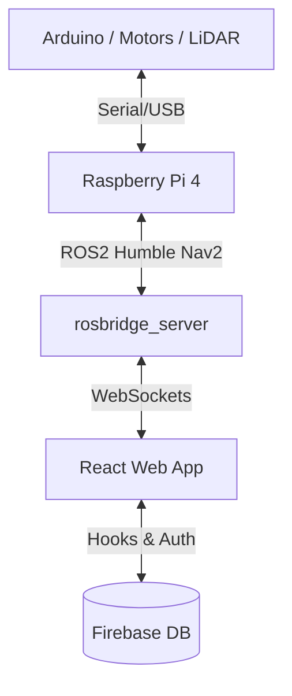

# ROS 2 Autonomous Smart Wheelchair ♿🤖

<div align="center">
  <!-- TODO: Add a GIF or Image of the wheelchair moving or the smart dashboard here! -->
  
</div>

An end-to-end **Autonomous Smart Wheelchair** powered by ROS 2 (Humble), Raspberry Pi 4, and 2D LiDAR. 

This assistive technology project features room-to-room predictive navigation, real-time hardware fall detection, and a React-based Web Dashboard allowing the user to control the chair entirely with their voice, while Caregivers can track the chair remotely.

---

## ✨ Key Features
- **Predictive Autonomous Navigation**: Powered by the official ROS 2 `Nav2` stack and Google Cartographer for 2D Simultaneous Localization and Mapping (SLAM).
- **Remote Telemetry Dashboard**: A React + Vite web application synced in real-time via Google Firebase to track the wheelchair's location globally.
- **Mobile Voice Control**: Utter commands like *"Wheelchair, go to Kitchen"* directly from your phone using the Web Speech API.
- **Emergency Logging & Fall Detection**: Hardware-level MPU6050 tip-over detection that instantly publishes alerts directly to the Caregiver's database log.

## 🧠 Architecture Approach: Why 2D LiDAR over 3D Vision?
A common question from recruiters is why we relied on purely 2D LiDAR instead of a Camera-only (V-SLAM) pipeline like Tesla Vision.

Processing dense computer vision at 30 FPS requires a dedicated hardware GPU tensor (like an Nvidia Jetson Orin). Running real-time Vision processing on a Raspberry Pi 4 alongside the ROS 2 Navigation stack would max out the CPU, causing massive latency. The RPLidar A1 is a brilliant engineering tradeoff because it offloads the dense mapping by computing precise millimeter point clouds natively on its own spinning hardware, routing lightweight arrays over USB. This allows the Pi to navigate perfectly with ultra-low compute overhead.

---

## 🛠️ Hardware & Components

### Parts List
| Component | Voltage | Current | Key Notes |
| :--- | :--- | :--- | :--- |
| **JGA25-370 Motors (x2)** | 12V DC | 0.04-2A each | 11 PPR encoder, 21.3:1 ratio, 280 RPM |
| **Raspberry Pi 4B** | 5V DC | 3A minimum | 4GB RAM, runs ROS2 Humble (Main Brain) |
| **Arduino Uno R3** | USB Powered | ~500mA | Motor control, PID, & encoder reading |
| **L298N Motor Driver**| 12V Supply | Up to 2A per motor| Dual H-Bridge |
| **RPLidar A1** | 5V DC | 100mA | 360° laser scanner, USB UART interface |
| **MPU6050 IMU** | 3.3V DC | ~3.5mA | Gyro + Accel for Fall Detection |
| **18650 Cells (x3)** | 11.1V (3S) | Capacity varies | Powers the motors |

### Wiring Guide
*⚠️ Safety Note: Ensure all grounds (Battery, Arduino, L298N) are connected together (Common Ground).*

**1. Power Distribution**
- **3S 18650 Battery (11.1V)** ➔ `L298N` `12V` & `GND` terminals (Powers motors *only*).
- **5V/3A Power Bank** ➔ `Raspberry Pi 4` (USB-C).
- **RPi USB** ➔ `Arduino Uno` (Provides 5V power + Serial data).
- **RPi USB** ➔ `RPLidar A1`.

**2. 12V Motors & Encoders to L298N & Arduino**
- **Left Motor**: Power ➔ L298N `OUT1`/`OUT2`. Encoders ➔ Arduino `Pin 2` (Yellow), `Pin 4` (Green). 
- **Right Motor**: Power ➔ L298N `OUT3`/`OUT4`. Encoders ➔ Arduino `Pin 3` (Yellow), `Pin 5` (Green).
- Both Encoders: Blue ➔ `5V`, Black ➔ `GND`.
- L298N Control: `ENA` ➔ `6`, `IN1` ➔ `7`, `IN2` ➔ `8`, `ENB` ➔ `11`, `IN3` ➔ `12`, `IN4` ➔ `13`. *(Remove ENA/ENB jumpers!)*

**3. MPU6050 IMU to Arduino**
- `VCC` ➔ `3.3V`, `GND` ➔ `GND`, `SDA` ➔ `A4`, `SCL` ➔ `A5`.

---

## 💻 Software Architecture & Installation



### 1. Raspberry Pi Setup (ROS 2)
1. Install **Ubuntu 22.04 Server** on the Raspberry Pi.
2. Install **ROS 2 Humble**.
3. Build the workspace:
```bash
mkdir -p ~/wheelchair_ws/src
cd ~/wheelchair_ws/src
git clone <THIS-REPO-URL>
cd ~/wheelchair_ws
colcon build --symlink-install
source install/setup.bash
```

### 2. Web App Dashboard Setup
Inside the `/web_app` folder of this repo:
```bash
npm install
npm run dev
```
**Security Note:** Create a `.env` file in your `web_app` directory containing your strict Firebase Config limits. Never commit it to GitHub. Ask a caregiver to provision your credentials!

---

## 🧗‍♂️ Challenges & Lessons Learned
Recruiters: Here are a few distributed system bugs we solved to get this working!

- **WebSockets on Mobile Security Restrictions**: Mobile Chrome instantly blocks microphone access (Web Speech API) on standard HTTP network addresses. We securely bypassed this by converting the Vite dev server to HTTPS and writing a custom dynamic `wss://` proxy to tunnel the unencrypted ROS WebSockets securely.
- **Distributed State Duplication**: If multiple caregivers (Laptop + Phone) open the dashboard, a single ROS emergency broadcast triggers multiple simultaneous Firebase DB writes. We solved this distributed systems bug by moving from random `addDoc` IDs to deterministic `setDoc` overwrite keys, combined with a 3-second hardware `rclpy` cooldown timer!
- **Zero-Latency Telemetry Math**: Instead of relying on slow, bandwidth-heavy terminal log subscriptions to track when a goal is reached, we hooked our UI directly into the `nav_msgs/Odometry` stream and built a custom Euclidean distance calculation algorithm that efficiently tracks physical arrivals in real-time.

---

## 🚧 Limitations & Future Scope
- **2D Plane Constraint**: The RPLidar A1 only scans a 2D slice at knee-height. It cannot detect dynamic 3D obstacles like an overhanging table corner or dropped laundry. 
- **Future Improvement:** In a Phase 2 rollout, we plan to shift computation to an Nvidia Jetson Nano and integrate an Intel RealSense Depth Camera to run 3D Voxel grid obstacle avoidance.
